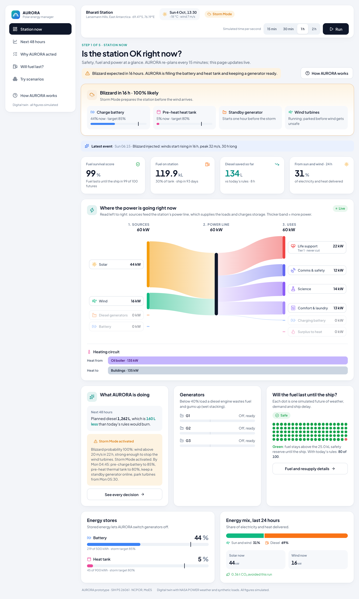
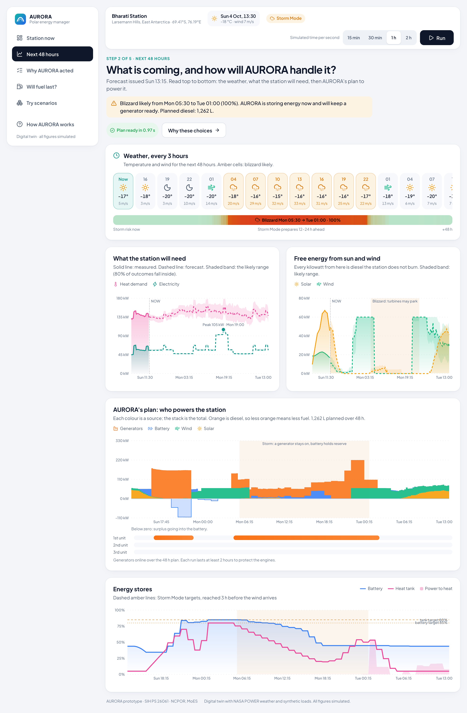
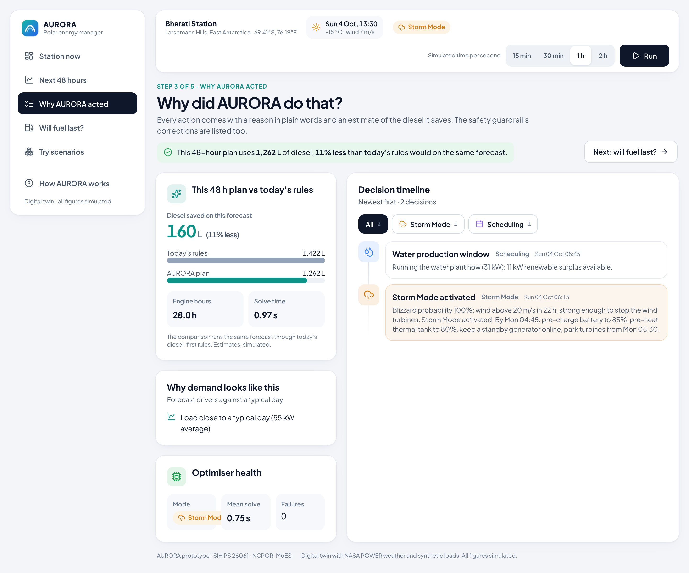
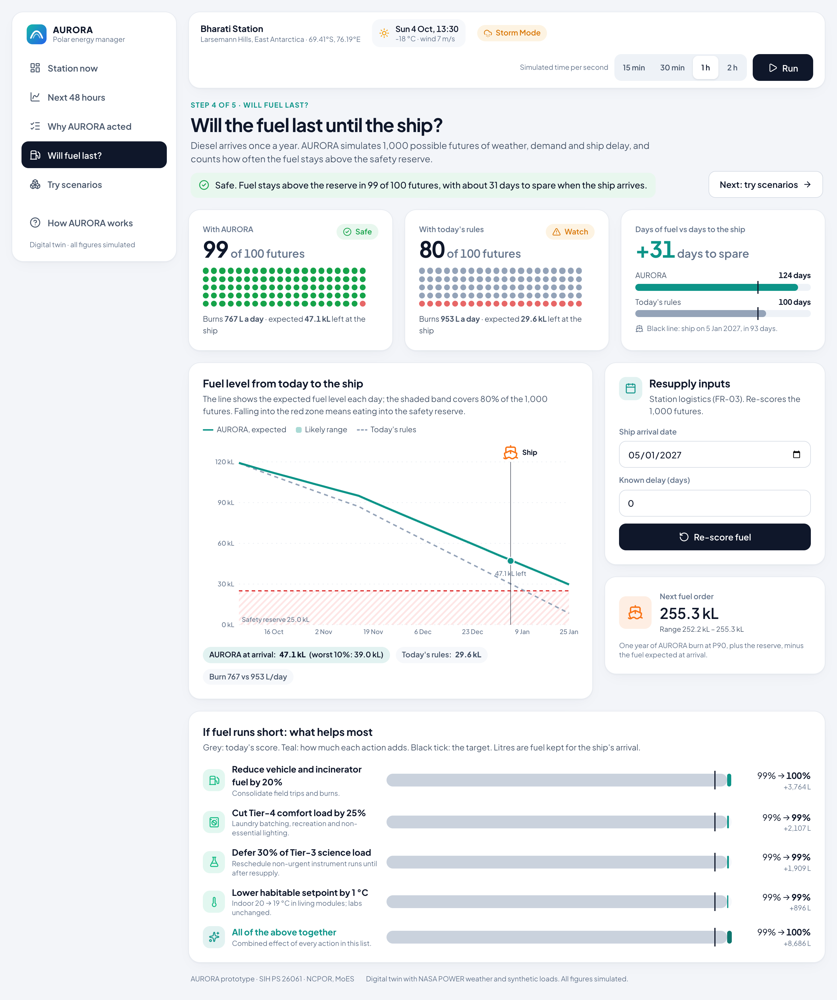
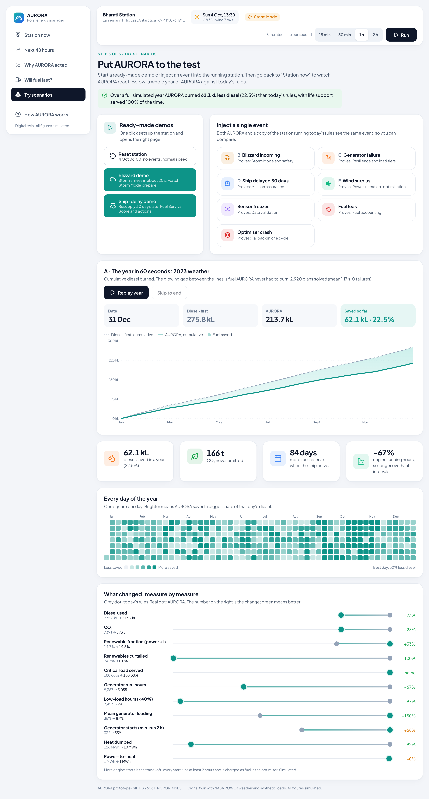

# AURORA

**Autonomous Unified Resource Optimization for Remote Antarctic and Arctic stations.** This is the prototype for SIH problem statement **26061**: *AI-Driven Smart Energy Management System for Polar Research Stations* (MoES · NCPOR · Clean & Green Technology).

AURORA is an offline-first energy brain for India's polar stations. It forecasts the next 48 hours and plans generators, battery, heat and flexible loads together. A safety guardrail checks every action before it reaches the station. It also answers the station leader's main question as a probability: *will our fuel last until the ship arrives?*

## Try it

- **Demo website (no install):** https://ravivarmakompally9.github.io/aurora/ replays recorded runs of the digital twin in your browser: a normal day, the blizzard demo, a 30-day ship delay and the full-year comparison.
- **Full live app in the cloud:** [open in GitHub Codespaces](https://codespaces.new/ravivarmakompally9/aurora). It installs everything and opens the dashboard on port 8765 (first start takes a few minutes).
- **Demo video (2:53):** download `aurora_demo.mp4` from the [latest release](https://github.com/ravivarmakompally9/aurora/releases/latest). The narration script is in [demo_video/VOICEOVER.md](demo_video/VOICEOVER.md).
- **On your own computer:** see [Quick start](#quick-start).



| Next 48 hours | Why AURORA acted |
|---|---|
|  |  |
| **Will fuel last?** | **Try scenarios** |
|  |  |

Tablet versions are in [docs/screenshots/](docs/screenshots/). All figures are simulated.

## Results on the digital twin (simulated)

These are full-year results on 2023 NASA POWER weather at Bharati, AURORA against today's diesel-first rules, on the same twin with the same loads and events. They come from simulation only and are not measured at a real station. See [docs/data_card.md](docs/data_card.md).

| KPI (PRD §4) | Diesel-first | AURORA |
|---|---|---|
| Diesel used | 275,831 L | **213,715 L (−22.5%)** |
| CO₂ | 739 t | 573 t (−166 t) |
| Renewable fraction (power + heat) | 14.7% | 19.5% |
| Renewables curtailed | 24.7% | 0.0% |
| Critical load served | 100% | 100% |
| Generator run-hours | 9,367 | 3,055 |
| Low-load hours (<40%, wet stacking) | 7,453 | 241 |
| Mean generator loading | 35% | 87% |
| Generator starts | 332 | 559 |
| Generator runs shorter than 2 h | 189 | 0 (2 cut off at year end) |
| Reserve days gained at resupply | – | about 84 |

How the year was run: 2,920 MILP solves (mean 1.2 s, 0 failures) in about 9 min on 10 cores.

**How robust is it?** [docs/analysis.md](docs/analysis.md) has the full evidence:
- **On today's equipment** (generators and waste heat only), AURORA alone saves **8.5%**.
- **The saving comes mainly from** battery scheduling (36%), waste-heat storage (33%) and generator commitment (25%).
- **Under stress the saving stays between 21.3% and 21.9%:** doubled forecast error, a 3 °C colder year, 25% more crew, half the battery, and Bharati's published crew size.

The trade-off is engine starts: 559 a year against 332. AURORA switches units off whenever the battery and renewables can carry the load. To protect the engines:
- every start must run at least **2 hours**, enforced by both the plan and the safety guardrail;
- each start costs 10 L-equivalent in the optimiser (4 L cold-start fuel plus 6 L of wear).

In return, generator running hours fall by 67% (9,367 → 3,060 h), which is what drives overhaul intervals. Per unit that is about one start every two days.

The baseline is left as today's practice: 189 of its runs last under 2 hours, and forcing longer runs on it would only raise its fuel use.

| Forecasting (test year 2023) | Result | PRD target |
|---|---|---|
| Load MAPE, 24 h ahead | 2.0% (persistence 7.6%) | < 10% |
| Heat MAPE, 24 h ahead | 5.3% (persistence 8.5%) | – |
| P10–P90 coverage, load / heat | 80% / 76% | ≈ 80% |
| 48 h plan, solve time | 0.2–1 s typical (10 s worst case) | < 30 s |

## Quick start

Needs Python via [uv](https://docs.astral.sh/uv/) and Node 20 or later. Weather data is already in `data/raw/`, so no internet is needed after install.

```bash
./start.sh
```

This installs dependencies, builds the dashboard if needed, runs the one-off year simulation on first use (about 8 min), and serves everything at http://127.0.0.1:8765. Use `./start.sh --dev` to work on the dashboard with live reload (port 5173).

To run the steps by hand:

```bash
uv sync && uv run aurora year --station bharati
```

```bash
npm --prefix dashboard install && npm --prefix dashboard run build && uv run aurora serve
```

The fuel planner needs the year comparison's output, so run `aurora year` before `serve`. For other commands, see [CLAUDE.md](CLAUDE.md).

**Ready-made demos.** *Try scenarios* → *Ready-made demos* has three one-click states (the first page's getting-started checklist also starts the blizzard demo):
- **Reset station:** a clean station at 4 Oct, 06:00.
- **Blizzard demo:** a storm rising in 16 h, with the clock at 1 simulated hour per second, so it hits in about 20 s.
- **Ship-delay demo:** resupply 30 days late, and the dashboard opens on *Will fuel last?*.

The same states are available from the API: `POST /api/sim/preset {"name": "reset" | "blizzard" | "ship_delay"}`.

## Five-minute demo (PRD §14.4)

1. **Hook.** *Station now*: the one-line answer at the top, the Fuel Survival Score, fuel on station and where the power is going.
2. **Problem.** *Try scenarios* → **A · The year in 60 seconds** opens on the finished year. Press **Replay year** to watch the diesel-first line pull away, then read *What changed, measure by measure* (curtailment, low-load hours).
3. **Solution.** *Next 48 hours*: the weather strip, demand, solar and wind bands, then who powers the station and the generator timeline.
4. **Live scenarios** on *Try scenarios*:
   - **B · Blizzard incoming:** winds start rising in 16 h and pass 20 m/s about 4–6 h later. Storm Mode switches on immediately. The plan pre-charges the battery to 85% and pre-heats the tank to 80% (using the boiler if needed) by 3 h before onset, keeps a standby generator online, and parks the turbines at cut-out. See *Why AURORA acted* for the reason cards. Tip: run at 60–120 min/s to reach the storm quickly.
   - **C · Generator failure:** trips the running unit (or a standby one, and says so). A "G1 tripped" card appears, the battery covers the gap and another unit takes over. Tier 1 is never shed.
   - **D · Ship delayed 30 days:** the Fuel Survival Score falls from 99% to 0%. Ranked conservation actions appear, and an "escalate to HQ" prompt shows because even all actions together only reach about 88%.
   - **E · Wind surplus**, a sensor freeze, a fuel leak, and an optimiser crash (falls back to diesel-first rules for 2 simulated hours, then recovers).
   - Events can be injected while paused: *Station now* shows each one in a "Latest event" line at once.
5. **Impact.** Fuel saved, CO₂ avoided and reserve days gained, from the year run.

## How it works

Every 15 minutes AURORA runs one loop: **sense → predict → decide → guard → act** (PRD §5–6).

| Module | What it does | PRD |
|---|---|---|
| `aurora/twin/` | Digital twin at 15-min steps: generators with fuel curve and waste-heat recovery; PV with sun angle, snow albedo and snow cover; wind with density, icing and cut-out; heated battery; thermal tank; boiler; deferrable water and laundry; events | FR-28–30 |
| `aurora/forecasting/` | Quantile gradient-boosted load and heat forecasts (P10/P50/P90), physics-plus-ML PV and wind, blizzard probability, conformal calibration, time-series CV | FR-04–08 |
| `aurora/optimizer/` | Pyomo + HiGHS MILP over 48 h: power and heat balance, units online and starts, battery and tank, power-to-heat, boiler, tiered shedding, spinning reserve sized on P90 load and P10 renewables. MPC executes only the current step. Reason cards explain each action | FR-09–13, FR-26 |
| `aurora/guardrail/` | Hard limits, 4 load tiers (Tier 1 never shed), reserve restoration, fallback to diesel-first | FR-14–16 |
| `aurora/storm_mode/` | Pre-charge, pre-heat, standby generator, turbine parking, with hysteresis | FR-17–18 |
| `aurora/fuel_planner/` | Monte Carlo Fuel Survival Score (1,000 scenarios), ranked conservation actions, next order quantity | FR-19–21 |
| `aurora/ingest/` | Modbus TCP link from twin to data hub, validation (missing / frozen / outlier, with imputation), SQLite store with the §9.3 schema, MQTT adapter | FR-01–03 |
| `aurora/api/`, `dashboard/` | FastAPI + WebSocket. React dashboard (five pages, light theme, 44–48 px touch targets, bundled fonts and icons for offline use). A static build (`VITE_STATIC=1`) replays recordings for the GitHub Pages demo | FR-24–27, NFR-09 |

## Where the prototype differs from the PRD

| PRD | Prototype | Why |
|---|---|---|
| LightGBM | scikit-learn `HistGradientBoostingRegressor` with quantile loss (same method) | LightGBM's macOS wheel needs Homebrew's OpenMP library |
| SHAP | Feature-group ablation for forecast drivers | Lighter, and gives the same kind of plain-language driver |
| ERA5 + NASA POWER | NASA POWER only | ERA5 needs a CDS account |
| TimescaleDB / InfluxDB | SQLite with the same schema; TimescaleDB is optional in docker-compose | Runs offline with no services |
| 15-min MPC for the whole year | Live mode: 15-min steps for 6 h, then hourly. Year mode: hourly plan re-solved every 3 h | Keeps a full year to minutes (PRD §16 mitigation) |
| Per-unit generator variables | Units online as one integer (all generators are identical) | Removes symmetry: solves went from about 25 s to under 1 s |

## Tests

`uv run pytest` runs 49 tests in about 3–5 min on an idle machine. They cover:
- energy and heat balance at every step;
- a baseline year in under a minute;
- MAPE below 10% and no lookahead in the forecasts;
- solve time under 30 s;
- Storm Mode preparing at least 12 h ahead and reaching its targets;
- Tier 1 never shed when two generators fail;
- fallback within one cycle;
- guardrail corrections;
- the Fuel Survival Score falling with delay;
- frozen and missing sensor handling;
- the Modbus round trip;
- the API end-to-end, including injecting events while paused;
- all generators tripped (the optimiser keeps planning instead of failing);
- Tier 1 (life support) is never cut while any Tier 2–4 load, laundry or water production is still powered;
- the 2-hour minimum generator run time.

A judge-style QA pass found and fixed 16 issues: see [docs/qa_report.md](docs/qa_report.md).

Not verified: `docker compose up`, because Docker isn't installed on the development machine. The `Dockerfile` and `docker-compose.yml` are provided but untested.

## Next steps (PRD P1/P2)

- Storm classifier trained on pressure and visibility.
- Generator health monitor (Isolation Forest, LSTM autoencoder).
- Manual override UI with audit log (the `overrides` table already exists).
- HQ sync and federated learning across stations.
- Science-window scheduler.
- What-if investment planner.
- Plug in NCPOR's real meter and equipment data through `configs/*.yaml` and the ingest layer.
