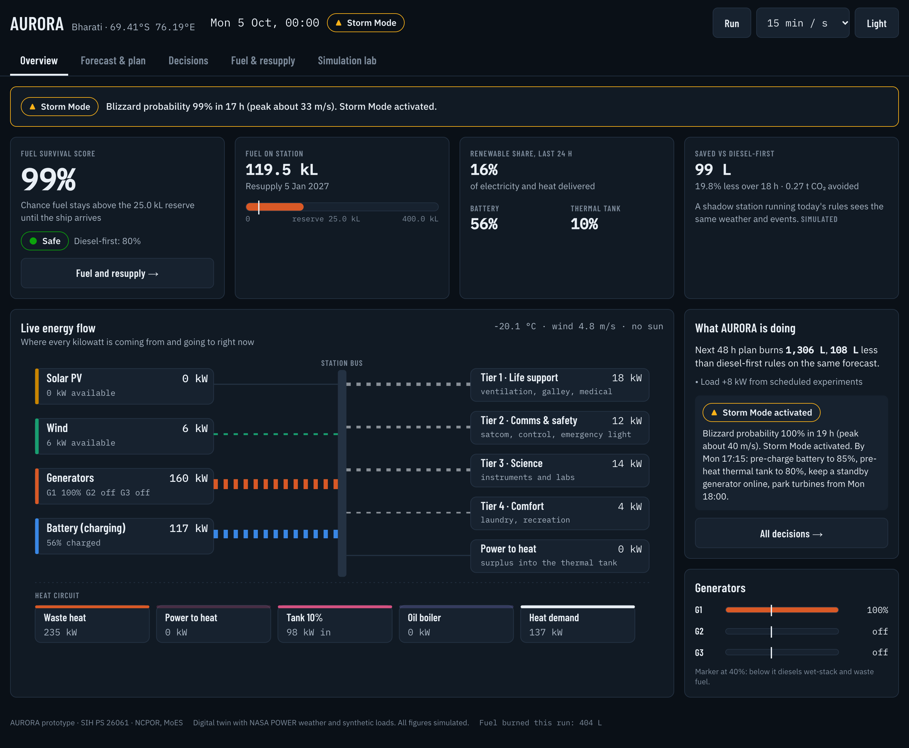

# AURORA

**Autonomous Unified Resource Optimization for Remote Antarctic and Arctic stations.** This is the prototype for SIH problem statement **26061**: *AI-Driven Smart Energy Management System for Polar Research Stations* (MoES · NCPOR · Clean & Green Technology).

AURORA is an offline-first energy brain for India's polar stations. It forecasts the next 48 hours and plans generators, battery, heat and flexible loads together. A safety guardrail checks every action before it reaches the station. It also answers the station leader's main question as a probability: *will our fuel last until the ship arrives?*



## Results on the digital twin (simulated)

These are full-year results on 2023 NASA POWER weather at Bharati, AURORA against today's diesel-first rules, on the same twin with the same loads and events. They come from simulation only and are not measured at a real station. See [docs/data_card.md](docs/data_card.md).

| KPI (PRD §4) | Diesel-first | AURORA |
|---|---|---|
| Diesel used | 275,831 L | **215,567 L (−21.8%)** |
| CO₂ | 739 t | 578 t (−161 t) |
| Renewable fraction (power + heat) | 14.7% | 19.5% |
| Renewables curtailed | 24.7% | 0.1% |
| Critical load served | 100% | 100% |
| Generator run-hours | 9,367 | 3,410 |
| Low-load hours (<40%, wet stacking) | 7,453 | 461 |
| Mean generator loading | 35% | 79% |
| Generator starts | 332 | 784 |
| Reserve days gained at resupply | – | about 81 |

How the year was run: 2,920 MILP solves (mean 0.95 s, 0 failures) in 7.4 min on 10 cores.

The trade-off is that AURORA starts generators more often, because it switches them off whenever the battery and renewables can carry the load. The optimiser charges a fuel-equivalent cost for every start, and the savings above are net of it.

| Forecasting (test year 2023) | Result | PRD target |
|---|---|---|
| Load MAPE, 24 h ahead | 2.0% (persistence 7.6%) | < 10% |
| Heat MAPE, 24 h ahead | 5.2% (persistence 8.5%) | – |
| P10–P90 coverage, load / heat | 80% / 76% | ≈ 80% |
| 48 h plan, 15-min resolution, solve time | 0.3–0.7 s | < 30 s |

## Quick start

Needs Python via [uv](https://docs.astral.sh/uv/) and Node 20 or later. Weather data is already in `data/raw/`, so no internet is needed after install.

```bash
uv sync
```

```bash
uv run aurora year --station bharati
```

```bash
npm --prefix dashboard install && npm --prefix dashboard run build
```

```bash
uv run aurora serve
```

Then open http://127.0.0.1:8765.

- `aurora year` trains and calibrates the forecasters on first use (about 20 s), then runs the year comparison (about 7 min).
- The fuel planner needs the year comparison's output, so run `aurora year` before `serve`.

For other commands, see [CLAUDE.md](CLAUDE.md).

## Five-minute demo (PRD §14.4)

1. **Hook.** Overview screen: Fuel Survival Score, fuel gauge, live energy flow.
2. **Problem.** Simulation lab → **A · Year in 60 seconds**. Watch the diesel-first line pull away, then read the KPI table (curtailment, low-load hours).
3. **Solution.** Forecast & plan: demand, solar and wind bands, then the 48 h dispatch plan.
4. **Live scenarios** in the Simulation lab:
   - **B · Blizzard incoming:** Storm Mode switches on about 16 h ahead. The plan pre-charges the battery to 85% and heats the tank to 80% by 3 h before onset, keeps a standby generator online, and parks the turbines at cut-out. See Decisions for the reason cards.
   - **C · Generator failure:** the remaining unit takes the load. Tier 1 is never shed.
   - **D · Ship delayed 30 days:** the Fuel Survival Score falls from 99% to 0%. Ranked conservation actions appear, and an "escalate to HQ" prompt shows because even all actions together only reach about 88%.
   - **E · Wind surplus**, a sensor freeze, a fuel leak, and an optimiser crash (falls back to diesel-first rules in one cycle).
5. **Impact.** Fuel saved, CO₂ avoided and reserve days gained, from the year run.

## How it works

Every 15 minutes AURORA runs one loop: **sense → predict → decide → guard → act** (PRD §5–6).

| Module | What it does | PRD |
|---|---|---|
| `aurora/twin/` | Digital twin at 15-min steps: generators with fuel curve and waste-heat recovery; PV with sun angle, snow albedo and snow cover; wind with density, icing and cut-out; heated battery; thermal tank; boiler; deferrable water and laundry; events | FR-28–30 |
| `aurora/forecasting/` | Quantile gradient-boosted load and heat forecasts (P10/P50/P90), physics-plus-ML PV and wind, blizzard probability, conformal calibration, time-series CV | FR-04–08 |
| `aurora/optimizer/` | Pyomo + HiGHS MILP over 48 h: power and heat balance, units online and starts, battery and tank, power-to-heat, boiler, tiered shedding, spinning reserve sized on P90 load and P10 renewables. MPC executes only the current step. Reason cards explain each action | FR-09–13, FR-26 |
| `aurora/guardrail/` | Hard limits, 4 load tiers (Tier 1 never shed), reserve restoration, fallback to diesel-first | FR-14–16 |
| `aurora/storm_mode/` | Pre-charge, pre-heat, standby generator, turbine parking, with hysteresis | FR-17–18 |
| `aurora/fuel_planner/` | Monte Carlo Fuel Survival Score (1,000 scenarios), ranked conservation actions, next order quantity | FR-19–21 |
| `aurora/ingest/` | Modbus TCP link from twin to data hub, validation (missing / frozen / outlier, with imputation), SQLite store with the §9.3 schema, MQTT adapter | FR-01–03 |
| `aurora/api/`, `dashboard/` | FastAPI + WebSocket. React dashboard screens 1–4 and 6. Dark by default, 48 px touch targets, bundled fonts for offline use | FR-24–27, NFR-09 |

## Where the prototype differs from the PRD

| PRD | Prototype | Why |
|---|---|---|
| LightGBM | scikit-learn `HistGradientBoostingRegressor` with quantile loss (same method) | LightGBM's macOS wheel needs Homebrew's OpenMP library |
| SHAP | Feature-group ablation for forecast drivers | Lighter, and gives the same kind of plain-language driver |
| ERA5 + NASA POWER | NASA POWER only | ERA5 needs a CDS account |
| TimescaleDB / InfluxDB | SQLite with the same schema; TimescaleDB is optional in docker-compose | Runs offline with no services |
| 15-min MPC for the whole year | Live mode: 15-min steps for 6 h, then hourly. Year mode: hourly plan re-solved every 3 h | Keeps a full year to minutes (PRD §16 mitigation) |
| Per-unit generator variables | Units online as one integer (all generators are identical) | Removes symmetry: solves went from about 25 s to under 1 s |

## Tests

`uv run pytest` runs 32 phase-gate tests in about 3.5 min. They cover:
- energy and heat balance at every step;
- a baseline year in under a minute;
- MAPE below 10% and no lookahead in the forecasts;
- solve time under 30 s;
- Storm Mode preparing at least 12 h ahead and reaching its targets;
- Tier 1 never shed when two generators fail;
- fallback within one cycle;
- guardrail corrections;
- the Fuel Survival Score falling with delay;
- frozen and missing sensor handling;
- the Modbus round trip;
- the API end-to-end.

Not verified: `docker compose up`, because Docker isn't installed on the development machine. The `Dockerfile` and `docker-compose.yml` are provided but untested.

## Next steps (PRD P1/P2)

- Storm classifier trained on pressure and visibility.
- Generator health monitor (Isolation Forest, LSTM autoencoder).
- Manual override UI with audit log (the `overrides` table already exists).
- HQ sync and federated learning across stations.
- Science-window scheduler.
- What-if investment planner.
- Plug in NCPOR's real meter and equipment data through `configs/*.yaml` and the ingest layer.
